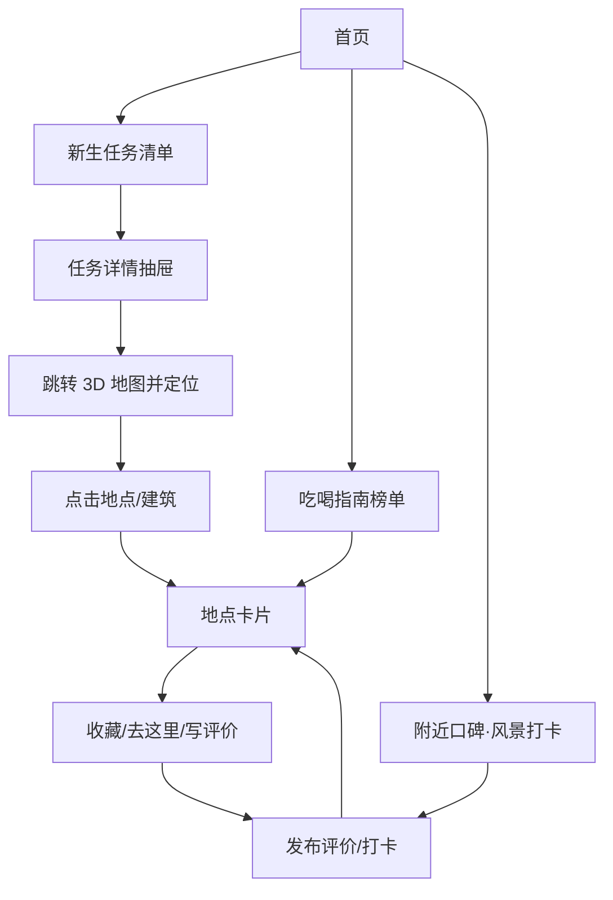

## 1. 产品概述
面向新生与在校生的校园生活指南平台，通过“地点（POI）内容底座”串联 3D 校园地图、任务清单、吃喝指南与地点口碑打卡。
- 解决信息分散、路径不清、踩坑成本高的问题，让用户以地点为中心快速完成了解、决策与行动
- 形成可持续的地点内容沉淀（评价/标签/图片/攻略），让校园生活更透明、更友好

## 2. 核心功能

### 2.1 用户角色
| 角色 | 登录方式 | 核心权限 |
|------|----------|----------|
| 游客 | 无需登录 | 浏览地图、地点卡片、榜单与公开口碑 |
| 普通用户 | 昵称登录（本地模拟） | 发布评价/打卡、收藏地点、勾选任务清单 |

### 2.2 功能模块（页面级）
1. **首页**：4 个入口卡片、全局搜索、精选推荐（新生必去/今日热榜）
2. **3D 校园地图**：可旋转/倾斜/缩放、地点筛选、点击地点弹出地点卡片
3. **新生任务清单**：任务分组、任务详情（材料/注意事项）、一键跳转地点与路线
4. **吃喝指南**：食堂/店铺榜单、筛选排序、点评聚合、跳转地点卡片
5. **附近口碑·风景打卡**：地点绑定发布、按地点/标签筛选、内容沉淀到地点卡片
6. **地点详情（地点卡片）**：基础信息、评分标签、图片墙、精选短评、去这里/写评价/收藏

### 2.3 页面详情
| 页面名称 | 模块名称 | 功能描述 |
|---------|----------|----------|
| 首页 | 入口卡片 | 3D 地图 / 新生清单 / 吃喝指南 / 口碑打卡四入口，支持键盘与移动端手势 |
| 首页 | 全局搜索 | 按地点名/分类/标签搜索，结果可直达地点卡片或地图定位 |
| 3D 校园地图 | 场景交互 | 旋转/倾斜/缩放；点击建筑或 POI 弹出地点卡片摘要 |
| 3D 校园地图 | 地点筛选 | 按分类筛选（食堂/风景/快递点/办事/自习/生活服务）并高亮 |
| 3D 校园地图 | 地图定位联动 | 从其他页面跳转时自动聚焦目标 POI 并弹出卡片 |
| 新生任务清单 | 任务分组 | 报到与账号、生活必备、学习与空间、校园服务等分组 |
| 新生任务清单 | 任务详情抽屉 | 显示材料清单、办理提示、推荐时间、关联地点 POI |
| 吃喝指南 | 榜单与筛选 | 人气/性价比/环境/排队友好等维度排序；进入地点卡片写评价 |
| 口碑·风景打卡 | 发帖 | 必须绑定地点与标签（出片/避雷/安静/排队长等），支持图片（可选） |
| 口碑·风景打卡 | 内容沉淀 | 新发布内容同步出现在对应地点卡片的“动态/攻略”区域 |
| 地点卡片 | 评分与标签 | 综合评分 + 维度标签（分类不同模板不同）+ 热门标签聚合 |
| 地点卡片 | 行动按钮 | 收藏、写评价、去这里（跳转地图定位与路线提示） |

## 3. 核心流程
核心用户流（推荐用于路演演示）：
1) 用户进入首页，选择“新生任务清单”查看待办事项
2) 选择某条任务查看详情，点击“去这里”跳转到 3D 地图并自动定位目标地点
3) 用户在地图中点击地点查看地点卡片，阅读攻略与口碑，必要时收藏
4) 用户前往“吃喝指南”或“口碑打卡”发布评价，评价回流并沉淀到地点卡片

## 4. 用户界面设计

### 4.1 设计风格
- 风格关键词：校园导览、信息清晰、带一点“杂志感”的精致排版
- 主色：深墨绿 + 米白（强调“校园”与“纸感”）
- 强调色：暖橙（用于行动按钮、评分高亮、关键状态）
- 字体：标题使用具有书刊气质的衬线中文字体，正文使用清晰的无衬线中文字体（通过 Web 字体引入）
- 布局：桌面优先；首页使用四卡片入口；详情以抽屉/侧栏呈现，减少页面跳转割裂感
- 图标：线性图标为主，少量实体徽章用于“新生必看/热门”

### 4.2 页面设计概览
| 页面名称 | 模块名称 | UI 元素 |
|---------|----------|--------|
| 首页 | 入口卡片 | 大标题 + 副标题 + 动效边框，悬停微光与轻微位移，强调“可探索” |
| 3D 校园地图 | 顶部工具条 | 分类筛选胶囊、搜索框、定位按钮；地图右下角信息角标 |
| 3D 校园地图 | 地点卡片摘要 | 半透明卡片 + 评分徽章 + 三条精选短评，支持展开查看详情 |
| 新生任务清单 | 分组列表 | 可勾选 + 进度条；任务项右侧显示关联地点与预计耗时（模拟） |
| 吃喝指南 | 榜单卡片 | 评分、热门标签、排队提示；一键“写评价”引导内容生产 |
| 口碑打卡 | 瀑布流 | 地点标签固定展示；内容短而密，强调实用信息与“出片点位” |

### 4.3 响应式
- 桌面优先，移动端使用底部导航或抽屉式菜单
- 地图支持触控手势（双指缩放、拖拽旋转），列表页支持惯性滚动与吸顶筛选条

### 4.4 3D 场景指导
- 氛围：柔和日光、略带暖色的环境光，强调“新生友好”的明亮感
- 光照：主平行光 + 环境光；关键建筑可使用轻微边缘高亮提示可交互
- 相机：默认俯视 35–55 度，可倾斜；交互聚焦时采用平滑缓动过渡
- 交互：悬停/点击高亮、POI 标注跟随缩放显示；从其他页面跳转时镜头平滑飞行到目标点
- 性能：控制模型面数与 draw call；首屏优先加载核心区域，非核心点位延迟加载
