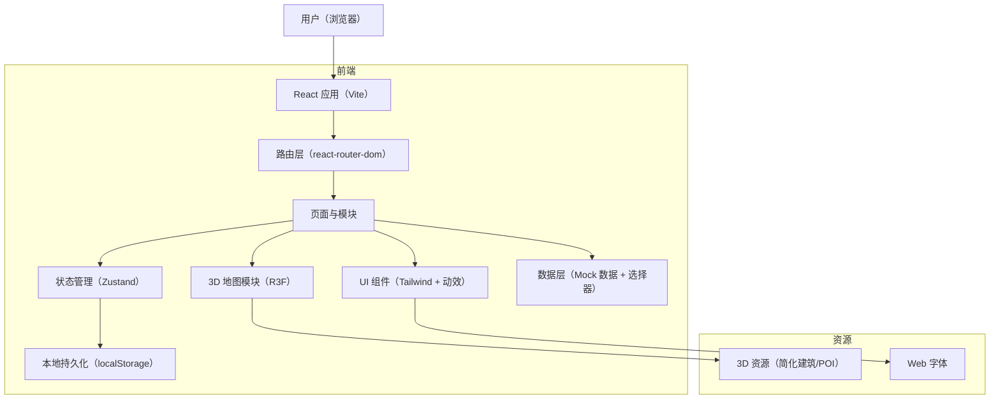
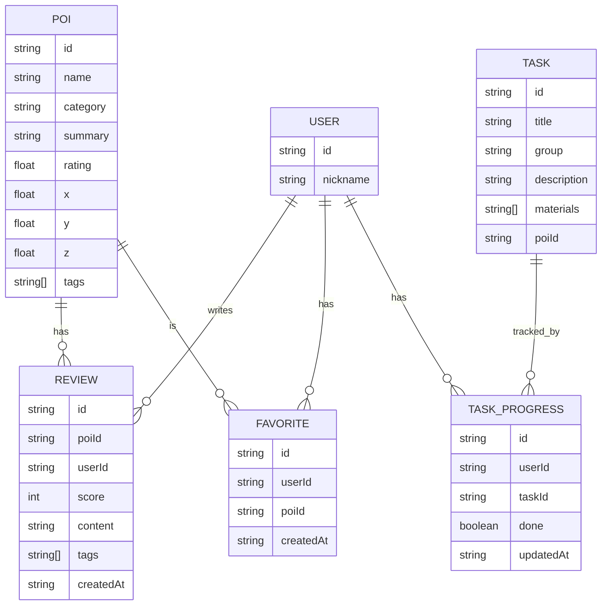

## 1. 架构设计

说明：
- 本 Demo 不引入后端服务，所有地点/评价/任务数据使用本地 Mock 初始化，并通过 localStorage 持久化用户操作
- 3D 地图作为独立模块嵌入 SPA，支持从其他模块“定位到地点”与“打开地点卡片”

## 2. 技术说明
- 前端：React@18 + TypeScript + Vite
- 路由：react-router-dom（用于模块化入口与可分享链接）
- 样式：tailwindcss@3（含自定义主题变量与动效）
- 状态管理：zustand（POI 数据、用户收藏、评价、任务清单进度、UI 抽屉状态）
- 3D：three + @react-three/fiber + @react-three/drei（轨道控制、相机飞行、标注）
- 数据：Mock（JSON/TS 模块）+ localStorage 持久化
- 测试（可选）：vitest + @testing-library/react（基础渲染与关键流程测试）

## 3. 路由定义
| 路由 | 用途 |
|------|------|
| / | 首页（四入口 + 搜索 + 精选） |
| /map | 3D 校园地图 |
| /tasks | 新生任务清单 |
| /food | 吃喝指南 |
| /feed | 附近口碑·风景打卡 |
| /poi/:id | 地点卡片详情（可从任意入口打开，也可作为抽屉模式叠加在当前页） |

## 4. API 定义（无后端）
本 Demo 不提供网络 API。数据访问通过前端数据层函数封装，以便未来扩展为真实后端。
- getPois(): POI[]
- getPoiById(id): POI | undefined
- addReview(poiId, payload): Review
- toggleFavorite(poiId): void
- toggleTask(taskId): void

## 5. 数据模型

### 5.1 数据模型定义

### 5.2 本地存储结构（localStorage）
- key: campus_guide_user（用户信息）
- key: campus_guide_favorites（poiId 列表）
- key: campus_guide_reviews（Review 列表）
- key: campus_guide_tasks（taskId -> done）

